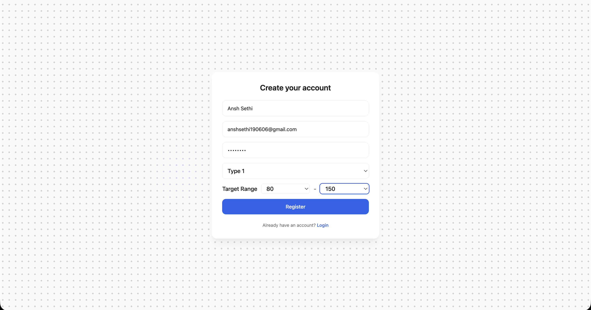
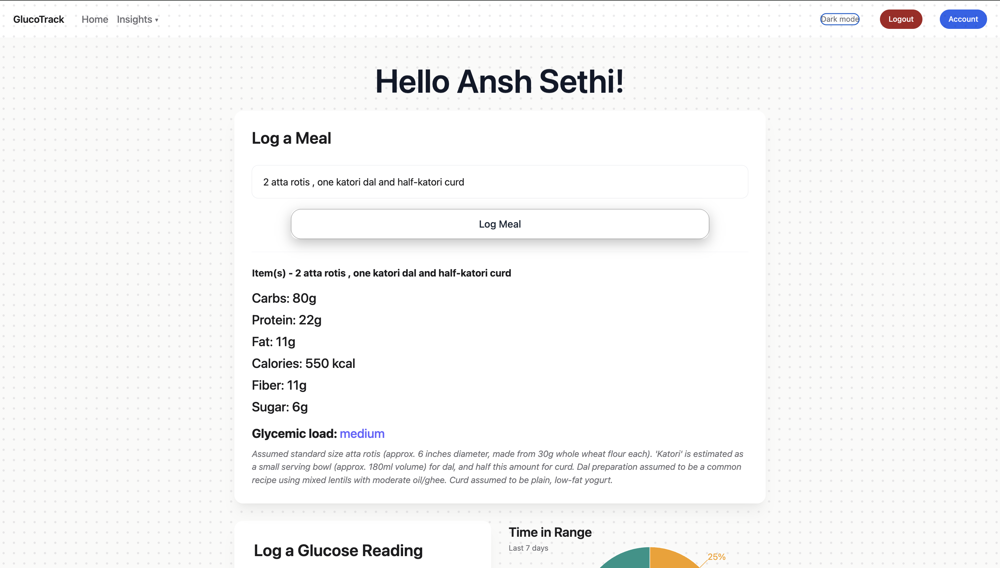
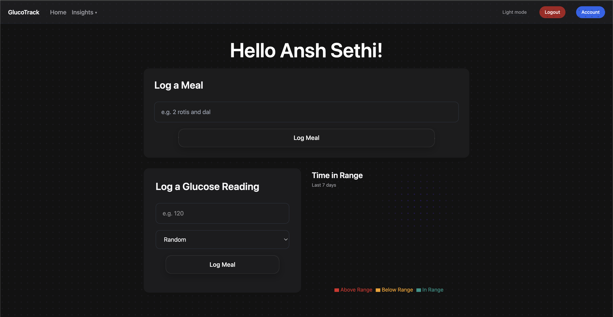
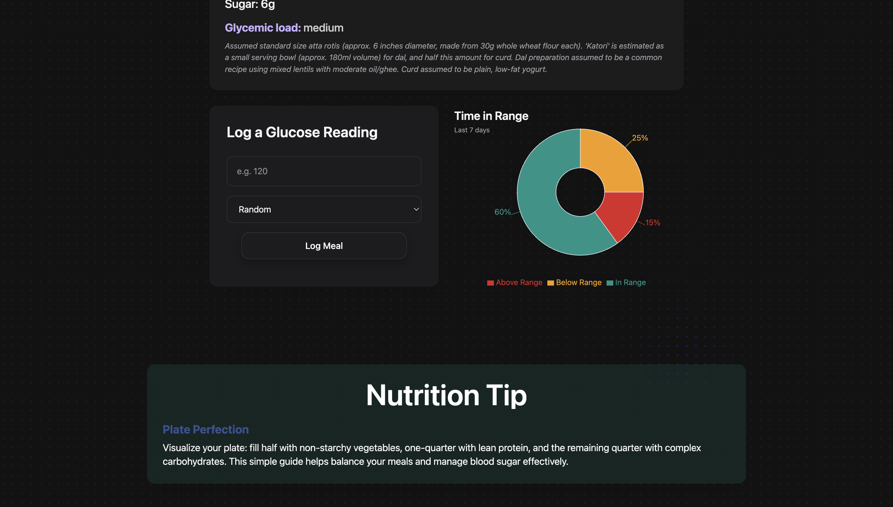
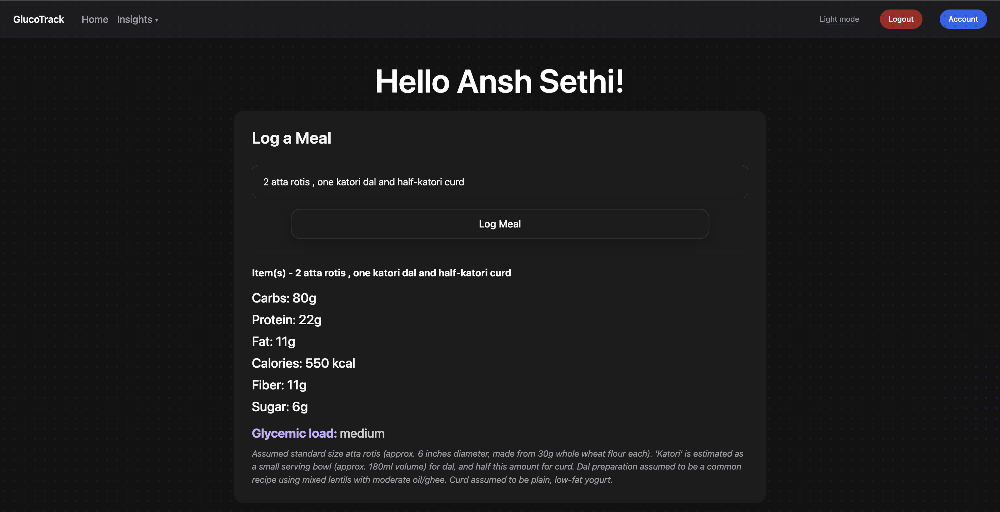
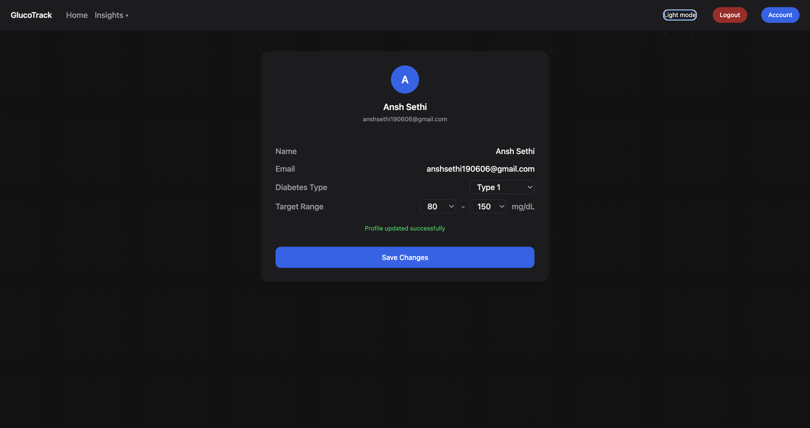

# GlucoTrack

**An AI-powered diabetes management platform built with the MERN stack.**

GlucoTrack helps people with diabetes track meals, log blood glucose readings, and understand their metabolic patterns — powered by Google's Gemini AI for nutrient estimation and personalized health insights.

> **Why I built this:** As someone managing diabetes myself, I wanted a tool that didn't just log numbers, but actually helped me understand *why* my glucose behaves the way it does — especially without the repetitive task of manually looking up carb counts for every meal. GlucoTrack is that tool.


---

## Features

- **AI-powered meal logging** — describe a meal in plain text ("2 rotis and dal") and get an instant nutrient breakdown (carbs, protein, fat, calories, fiber, sugar) via Google's Gemini API
- **Glucose reading tracker** — log readings with context (fasting, before/after meal, bedtime, random)
- **Time-in-range analytics** — real MongoDB aggregation pipelines compute the clinically-relevant "% of readings in target range" metric, visualized with an interactive donut chart
- **AI-generated daily nutrition tips** — personalized, practical tips generated on demand
- **Live diabetes health news** — pulled from a third-party news API via a backend proxy
- **Secure authentication** — JWT access + refresh tokens, bcrypt password hashing, httpOnly refresh cookies, and email OTP verification on registration
- **Dark mode** — persisted across sessions, with smooth transitions
- **Custom UI** — Tailwind CSS, ambient animated backgrounds, and Apple-inspired micro-interactions

---

## Tech Stack

| Layer | Technology |
|---|---|
| Frontend | React (Vite), Tailwind CSS, React Router, Recharts |
| Backend | Node.js, Express |
| Database | MongoDB (Mongoose) |
| AI | Google Gemini API |
| Auth | JWT (access + refresh tokens), bcrypt, email OTP |
| News | Mediastack API | Google Gemini API

---

## Architecture Highlights

- **AI as a structured tool, not a chatbot** — Gemini is prompted to return strict JSON for nutrient estimation and tips, with a system prompt designed to minimize hallucination and flag uncertain assumptions (e.g. estimated portion sizes) rather than silently guessing.
- **Real aggregation, not application-level math** — Time-in-range is computed using a MongoDB aggregation pipeline (`$match` → `$group` → `$cond`), calculating below/in/above-range percentages at the database layer rather than pulling all documents into Node and looping over them.
- **Layered auth** — Short-lived access tokens (localStorage) paired with long-lived refresh tokens (httpOnly cookies), plus OTP email verification to confirm real user identity at signup.

---

## Screenshots

### Registration page



### Dashboard





### Dashboard — Meal Logging & AI Nutrient Estimation



### Profile Page



---

## Getting Started

### Prerequisites
- Node.js (v18+)
- MongoDB Atlas account (or local MongoDB instance)
- Gemini API key ([Google AI Studio](https://aistudio.google.com))
- Mediastack API key ([mediastack.com](https://mediastack.com))

### Installation

```bash
git clone https://github.com/ansh1906/carb-tracker.git
cd carb-tracker
```

**Backend setup:**
```bash
cd server
npm install
npm i nodemon
```

Create a `.env` file in `server/`:
```
PORT=5001
MONGO_URI=your_mongodb_connection_string
JWT_SECRET=your_jwt_secret
JWT_REFRESH_SECRET=your_refresh_secret
GEMINI_API_KEY=your_gemini_key
MEDIASTACK_API_KEY=your_mediastack_key
NODE_ENV=development
```

```bash
nodemon server.js
```

**Frontend setup:**
```bash
cd client
npm install
npm run dev
```

Visit `http://localhost:5173` (Might be a different port if 5173 happens to be occupied by any other running server).

---

## Project Structure


glucotrack/
├── client/          # React.js frontend (Vite + Tailwind)
│   └── src/
│       ├── components/
│       ├── pages/
│       ├── services/
│       └── hooks/
├── server/          # Express.js backend
│   └── src/
│       ├── models/
│       ├── config/
│       ├── controllers/
│       ├── routes/
│       ├── middleware/
│       ├── utils/
│       └── services/


---

## What I'd Improve With More Time

- Deeper meal-to-glucose correlation insights (AI narrating historical patterns, not just single-meal estimates).
- Doctor-shareable PDF export of trends and adherence.
- A doctor/caregiver role with read-only shared access.
- More concise and user's diabetes oriented news and headlines.
- Rate limiting and caching specifically on AI-calling routes to control API costs at scale.

---

## Disclaimer

GlucoTrack is a personal/portfolio project and is **not a medical device**. Nutrient estimates and AI-generated tips are informational only. Always consult a healthcare provider for diabetes management decisions.

---

## License
MIT
